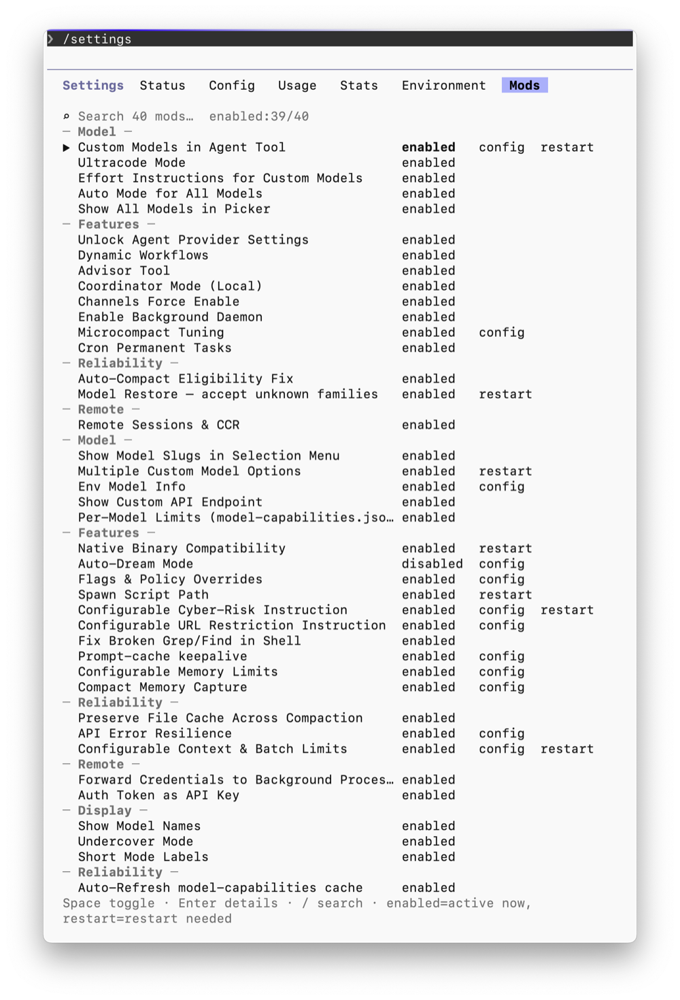
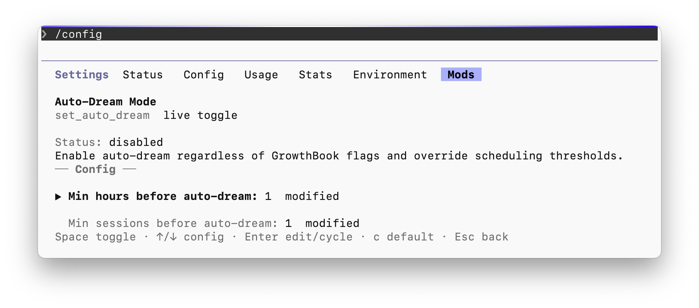

# claude-mod

Since mid-2025, I have used this project to heavily modify, patch, and extend Claude Code in a number of ways. In late 2026 I moved on to a heavily customized `pi`, but I wanted to still open source this project for others who might have use in it.

claude-mod downloads an official Claude Code package, transforms it on your machine, and runs the result with Bun. The repository distributes the patching tool—not Claude Code or a prepatched binary. The goal is to smooth out the friction around typical patching, and provide a full TUI UX for enabling, disabling, and toggling mods. I call it "un-nerfing" — Anthropic has historically restricted lots of things to specific models (like opus only) or disabled them when using a 3PP. In other cases, features are gated, entirely hard-coded off, or added and then removed silently.

These mods are focused on re-enabling these things, for 3PP and non-Anthropic models. There are also tweaks and toggles exposed to configure things that are otherwise unconfigurable.

It is very easy to extend and expand with new mods. This is done using YAML, extending new patches, and exposing the new mod via a Mods TUI panel alongside other TUI configuration.

claude-mod patches your local installation — it does not distribute pre-built binaries or Anthropic's code. The neat thing is, once patched, you don't need to keep repatching to enable, disable, or configure the mods — you use the TUI Mods panel.



<figure>
<figcaption><strong>The Mods panel</strong> — every mod grouped by category, with live toggles. Some entries expose a <code>config</code> submenu (see below) or a <code>restart</code> indicator for changes that need a restart.</figcaption>
</figure>



<figure>
<figcaption><strong>A mod's config submenu</strong> — a live toggle plus editable values, reached by pressing <code>Enter</code> on a mod that exposes a <code>config</code> action.</figcaption>
</figure>

Skills for creating new mods and maintaining version compatibility are included in `.claude/skills/`.

**Supported release: Claude Code 2.1.181 on macOS.**

I had it working on Linux too, with Claude Code Actions, and I'll work on getting that back up next, along with the latest version. Compatibility was maintained back to ~1.3 in private history, but I've squashed everything before making this public.

Starting with 2.1.242, Claude Code ships as code-split ESM chunks instead of a single bundled file. claude-mod handles this automatically. On 2.1.181, 43 patches apply and one is version-gated (`model_picker_search`). On 2.1.277, the same 43 patches apply with 6 code-split skips — `mods_runtime`, `remove_attribution`, `add_cache_keepalive`, `unlock_permanent_cron`, `unlock_models`, and `model_picker_search`. The skips are tracked in `CODESPLIT_SKIP_PATCHES` inside `bin/patch.cjs`. The supported release stays at 2.1.181 until a fresh-install gate passes for a code-split version.

---

## What it changes

- **Models:** custom model selection, model limits, effort settings, and session restoration.
- **Providers:** endpoint display, authentication forwarding, and configurable request retries.
- **Context:** compaction, memory limits, and cache behavior.
- **Interface:** a **Mods** tab in `/config` for behavior switches and an **Environment** tab for configuration.

The full ordered patch set is applied together; supported behavior switches are controlled at runtime. Some features still depend on upstream services or authentication. A local modification does not grant access to those services.

## Install from source

You need **Bun**, **Node.js 22+**, **npm**, and the macOS Command Line Tools. webcrack's native dependencies may also require Python 3 and a C++ toolchain.

```sh
git clone https://github.com/kierr/claude-mod.git
cd claude-mod
bun install --frozen-lockfile
npm install -g . webcrack@2.15.1
claude-mod doctor
claude-mod update
```

`update` uses the version shipped in `last-tested-version`—currently **2.1.181**—rather than the latest upstream release. It patches that version, installs native dependencies, checks `--version` and `--help`, and installs a launcher at `~/.local/bin/claude`. It refuses to replace an existing unmanaged launcher. Ensure that directory is on your `PATH`.

Open `/config` in the patched client to configure mods. Prefer an official setting or environment variable when it already provides the behavior you need.

## Commands

```sh
claude-mod update                 # patch and install the supported version
claude-mod patch 2.1.181          # build without installing a launcher
claude-mod run 2.1.181 -- --help   # run a cached build
claude-mod install 2.1.181        # install or restore a chosen version
claude-mod status --all           # list cached versions
claude-mod doctor                # check local prerequisites
claude-mod uninstall             # remove the managed launcher
```

Explicit version arguments are available for development; they do not imply that another upstream version is supported. Without a version, `run` uses an explicitly installed version or the packaged supported default. It never checks for or promotes upstream updates in the background. Use `claude-mod --help` for the full command list.

## Local files

- `~/.cache/claude-mod/`: downloaded packages and generated builds.
- `~/.local/lib/claude-mod/`: installed versions, separate from the cache.
- `~/.local/bin/claude`: managed launcher.
- `~/.claude/mods.json`: mod settings.

Valid cached stages are reused. Failed or changed patch artifacts cannot be installed or run. `patch --force` rebuilds the patched output; it is not a request to download everything again. Installation validates an independent copy before switching the live launcher, preserving the previous build on failure. `uninstall` leaves validated installed versions available for `install <version>`, even after their build cache is removed. Older installations without a successful artifact manifest must be patched again.

## Contributing

See [CONTRIBUTING.md](CONTRIBUTING.md) for development commands and patch requirements. [AGENTS.md](AGENTS.md) contains repository guidance for coding agents.

Use synthetic examples when reporting bugs. Do not attach upstream bundles, extracted code, prompt dumps, credentials, or private session data.

## License

MIT. See [LICENSE](LICENSE). This license covers claude-mod, not Claude Code.
